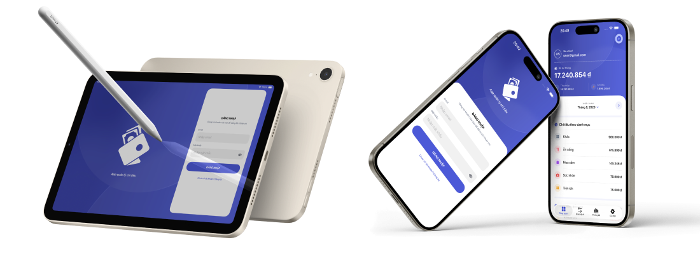

# Sổ Thu Chi

Ứng dụng iOS quản lý thu chi cá nhân, kết nối REST API để đồng bộ tài khoản, giao dịch, danh mục, ngân sách và số liệu tổng quan.

## Hình ảnh ứng dụng

Mockup minh họa giao diện Sổ Thu Chi trên iPad và iPhone, bao gồm màn hình đăng nhập và màn hình tổng quan các khoản thu chi theo danh mục.



## Video demo

[Xem video demo ứng dụng trên Google Drive](https://drive.google.com/file/d/1rfzWuS6rfyHwFmLPGaJYFs8ShpN6zF1C/view?usp=drive_link)

[](https://youtu.be/4901HLsknfA?si=IGr4G9Ecqv5nRz2t)

## Công nghệ

- **App:** Swift, SwiftUI, Clean Architecture, MVVM, URLSession, Keychain, Swift Charts.
- **Server:** NestJS, TypeScript, Prisma ORM, MySQL 8, JWT, bcrypt, Swagger/OpenAPI.
- **Môi trường:** Docker Compose; kiểm thử bằng Jest và Supertest.

## Chạy server

Yêu cầu Docker và Docker Compose:

```bash
cd server
cp .env.example .env
docker compose up --build -d
```

- API: `http://localhost:3000/api/v1`
- Swagger: `http://localhost:3000/api/docs`

Dừng server:

```bash
docker compose down
```

## Chạy App

1. Mở `app/ExpenseTracker.xcodeproj` bằng Xcode.
2. Chọn scheme `ExpenseTracker` và Simulator, ví dụ `iPhone 17 Pro`.
3. Chọn **Product → Run** hoặc nhấn `⌘R`.

App mặc định kết nối tới `http://localhost:3000/api/v1`. Nếu dùng địa chỉ API khác, cập nhật khóa `API_BASE_URL` trong `app/ExpenseTracker/Info.plist`.

## Tài khoản test

- **Email:** `user@gmail.com`
- **Mật khẩu:** `User123456@`
